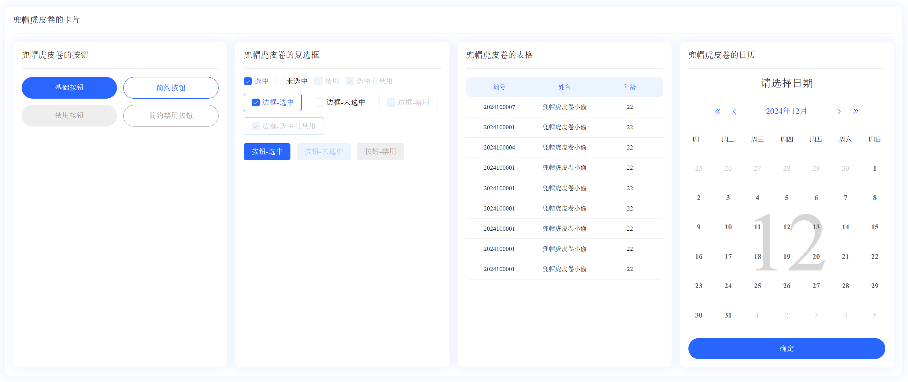

# 🍰兜帽虎皮卷的UI组件库



## 🖥 组件开发中

- [x] 兜帽虎皮卷的卡片
- [x] 兜帽虎皮卷的按钮
- [x] 兜帽虎皮卷的表格
- [x] 兜帽虎皮卷的单元格
- [x] 兜帽虎皮卷的多选框
- [ ] 兜帽虎皮卷的表单
- [ ] 兜帽虎皮卷的日历
- [ ] 兜帽虎皮卷的选择器
- [x] 兜帽虎皮卷的弹出层
- [ ] 兜帽虎皮卷的输入框
- [ ] 兜帽虎皮卷的加载
- [ ] 兜帽虎皮卷的骨架屏
- [ ] 兜帽虎皮卷的课程表

...

## 📦 如何获取

- ⚙️ 通过 NPM 安装

  ```
  npm install dmhpjUI
  ```

## 🔨 如何使用

- 🌍 全局导入

  ```ts
  //main.ts
  import DmhpjUI from "DmhpjUI";
  ...
  createApp(App).use(DmhpjUI).mount("#app");
  ```

- 🎨 局部引用

  ```vue
  //希望引入的页面
  import { dmCard, dmTable, dmTableColumn } from "DmhpjUI";
  
  <template>
    <dm-card>
      <dm-table :data="data">
        <dm-table-column prop="name" label="姓名"></dm-table-column>
        <dm-table-column prop="age" label="年龄"></dm-table-column>
      </dm-table>
    </dm-card>
  </template>
  ```


## ✨ 未来可期：）

- 🌈 感谢抹茶星璇老师的UI设计
  
